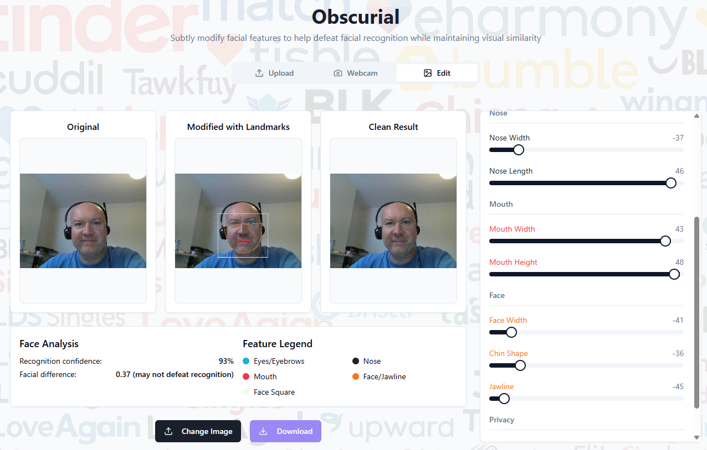

# Obscurial : Face Veil Disguise

A JavaScript-based face veiling tool that helps protect privacy in images by applying various disguise filters to detected faces to break facial recognition tools such as Pimeyes or Clearview.

## Overview

Face Veil Disguise is an open-source tool designed to anonymize images by applying various effects to detected faces. This can be useful for privacy protection when sharing photos online, for educational purposes, or in applications where facial privacy is a concern.

## Features

- **Multiple Disguise Options**
- **Face Detection**: Powered by face-api.js for accurate face detection
- **Browser-based**: Works entirely in the browser with no server uploads
- **Customizable**: Adjust disguise intensity and parameters
- **Save & Export**: Download modified image

## Getting Started

### Prerequisites

- Modern web browser (Chrome, Firefox, Safari, Edge)

### Installation

1. Clone the repository:
```
git clone https://github.com/misterpinks/Obscurial.git
cd Obscurial
```

2. Open `index.html` in your browser or set up a local server:
```
# Using Python's built-in server
python -m http.server
# Then open http://localhost:8000 in your browser
```

### Usage

1. Open the application in your browser
2. Upload an image using the "Choose File" button or drag and drop
3. Adjust settings as needed
4. Download the processed image using the "Save" button

## Example


## Browser Compatibility

- Chrome (v80+)
- Firefox (v75+)
- Safari (v13+)
- Edge (v80+)

## Privacy

- All processing happens locally in your browser
- No images are uploaded to any server
- No analytics or tracking included

## Contributing

Contributions are welcome! Please feel free to submit a Pull Request.

1. Fork the repository
2. Create your feature branch (`git checkout -b feature/amazing-feature`)
3. Commit your changes (`git commit -m 'Add some amazing feature'`)
4. Push to the branch (`git push origin feature/amazing-feature`)
5. Open a Pull Request

## License

This project is licensed under the MIT License - see the [LICENSE](LICENSE) file for details.

## Acknowledgments

- [face-api.js](https://github.com/justadudewhohacks/face-api.js) for face detection capabilities
- All contributors and open source projects that made this possible

## Contact

Project Link: [https://github.com/misterpinks/face-veil-disguise](https://github.com/misterpinks/Obscurial)

---

Made with ❤️ for privacy
